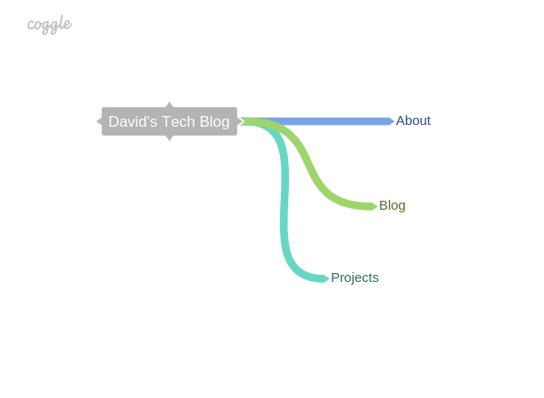

**What are the 6 Phases of Web Design?**

The six phases are:
1. Information Gathering
2. Planning
3. Design
4. Development
5. Testing and Delivery
6. Maintenance

**What is your site's primary goal or purpose? What kind of content will your site feature?**

My site's primary goal is to share my work history, background, passions and past projects to anyone who might be interested (future employers, collegues etc.). My website will feature a personal blog about my development through DBC and about myself, it will also feature, as I've mentioned earlier, past projects.

**What is your target audience's interests and how do you see your site addressing them?**

My target audience will be interested in knowing about myself, and my previous work. Because my primary audience will be people in the tech industry, I'll have to appeal to their interests in web design and 'show off' a bit in terms of the functionailty of my website.

**What is the primary "action" the user should take when coming to your site? Do you want them to search for information, contact you, or see your portfolio? It's ok to have several actions at once, or different actions for different kinds of visitors.**

For my visitors, I primarily want them to contact me and see my portfolio/blog. Preferably, they should see my portfolio and work first then decide to contact me.

**What are the main things someone should know about design and user experience?**

I think the main thing someone should know about design and user experience is that the results of these fields don't have directly measurable results. But UX and design are still very important in terms of the user experience and the 'feel' of the website.

**What is user experience design and why is it valuable?**

User Experience Design is the design of a user interface that appeals to the user experience, and decides whether or not a user becomes a regular user or not. It strives to create a meaningful experience for the user through ease of use and comfortability in interacting with the website - these factors matter a lot when you're looking for more users. Without properly considering user experience design, a website/program could lose thousands even millions of users.

**Which parts of the challenge did you find tedious?**

Honestly, the most tedious part of this challenge was reading about User Experience Design. While it is an important topic that needs to be considered while designing a website, I still think that UX can be left to web designers instead of a separate developer.