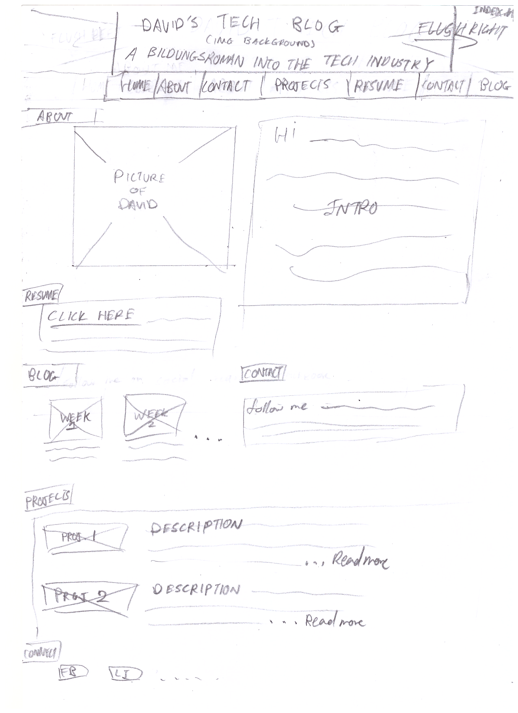
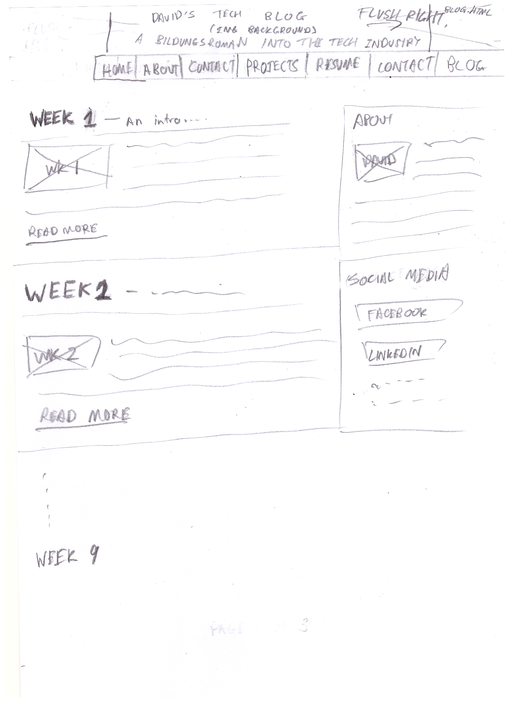

**What is a wireframe?**

A wireframe is the initial draft 'blueprint' of a website.

**What are the benefits of wireframing?**

Wireframes allow you to plan the design of your website before committing it to code. It prevents the coder from rabbit-holing if he/she were to just start coding straight away.

**Did you enjoy wireframing your site?**

I was a bit confused at first as to what to wire frame - there were too many possibilities and I was afraid of trying new things. After looking at a few examples on Google images, I started to understand what was required of a wireframe and got into the challenge.

**Did you revise your wireframe or stick with your first idea?**

I revised my wireframe quite a bit - I completely overhauled it from it's first design.

**What questions did you ask during this challenge? What resources did you find to help you answer them?**

The question that took the longest to answer for me was whether or not I should do my wireframe on an app or by hand. After considering the pros and cons of both, I felt it would be quickest and easiest by hand.

Another question I had was How specific I should make the wireframe. The guides online all mention not having to put any styling in your wireframe, but to what extent should I exclude styling?

**Which parts of the challenge did you enjoy and which parts did you find tedious?**

I enjoyed drawing the wireframe quite a bit after being inspired by the results on Google Images. I thought the beginner's guide to wireframing was quite useless after finding other guides online.
