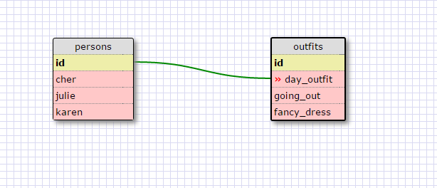

**What are databases for?**
Databases are for storing then accessing certain parts of that data.

**What is a one-to-many relationship?**
A one to many relationship is when a datum refers to another set of data - so one piece of datum has multiple data that refers to it.

**What is a primary key? What is a foreign key? How can you determine which is which?**
a foreign key refers to the keys in another table that it's linked to, whereas a primary key is the first column (the id column) in that table.

**How can you select information out of a SQL database? What are some general guidelines for that?**
You can select information out of an SQL database by giving it parameters to meet. So for example, in our state_data database, if we wanted to display only the states_names and population, we'd tell SQL to SELECT state_names, population FROM (the) states (table).

