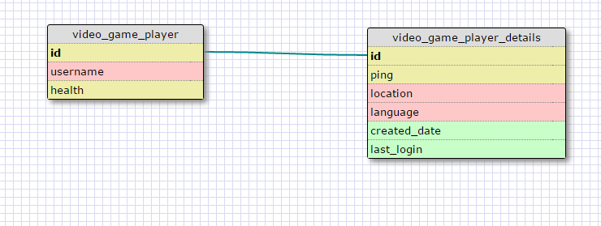
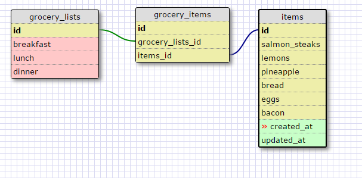

This relationship is a one to one relationship because the second table basically retains data for the first table so that querying can be easier.

REFLECTION

What is a one-to-one database?

A one to one database is when one row of one table directly corresponds to the rows in another table. It may not make much sense to separate these tables, but if you are querying a large amount of data, leaving out some uncommonly used data in another table may improve performance.

When would you use a one-to-one database? (Think generally, not in terms of the example you created).

In large databases and when some columns are not used very often.

What is a many-to-many database?

A many to many database is when the rows in one table correspond to multiple rows on another, and vice versa.

When would you use a many-to-many database? (Think generally, not in terms of the example you created).

You would use a many-to-many database when the data given corresponds to multiple rows and vice versa.

What is confusing about database schemas? What makes sense?

Wrapping your head around how complex database schemas (and even multiple-to-multiple databases!) can be quite confusing. It takes quite a bit of thinking to understand how the data corresponds to each other.